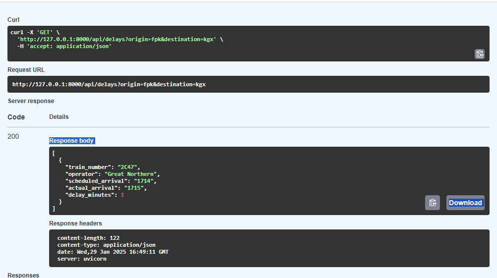

# Geospatial 

Credit: Realtime Trains

## Set project environment
- use conda to create an isolated envrionment 
- dependencies: fastapi, uvicorn, requests, python-dotenv, pandas, matplotlib, folium, geopandas
- initialise github repository for version control
- store environment variables to connect to Realtime Trains API securely 
- test connection to API

## Build the REST API 
### Set up a FastAPI project
-  initialise a FASTAPI project to structure the API

### Create basic endpoints:
- /api/trains: Get train  services btw stations. param: origin, destination
- /api/delays: Get data about delayed trains. Param: o, d 

[In Progress]
## Analyse spatial data 
- analyse delay clusters
- identify congestion hotspots (routes or stations)
- map with Folium and charts with Matplotlib

## Data Visualisation
- plot stations and train routes 
- delay heatmaps 
- operator performance dashborad
- time-based delay trends

## Optional
### CI/CD with Docker
### GitHub Actions
