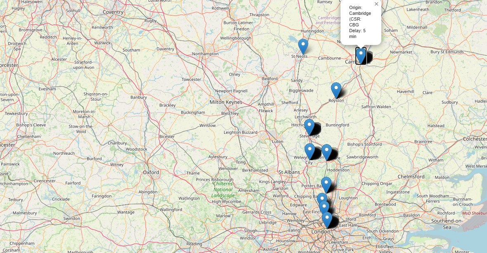

# 🚄 Geospatial Train Tracking & Delay Analysis


**Credit:** This project was only possible thanks to Realtime Trains API!

## 📌 Project Overview
This project analyzes train delays at **Finsbury Park (FPK)**, capturing **all arriving trains**, regardless of their origin. The project uses **FastAPI, PostgreSQL, SQLAlchemy, Pandas, and AsyncSession** for efficient database operations. Additionally, it includes **geospatial mapping with Folium & GeoPandas**.

## 📂 Project Structure
```
/train-tracking
│── main.py                # 🔄 Runs the full data pipeline & API
│── config.py              # 🛠️ Stores API credentials & configurations
│── integrate_data.py # 🔄 Merges train arrival and station geospatial data 
|
├── data_pipeline/         # 🌐 Data processing scripts
│   │── extract.py         # 📀 Extracts arrivals from RTT API (past 7 days)
│   │── clean.py           # 🌱 Cleans & processes data (calculates delays, adjust dates)
│   │── utils.py           # 🏢 Uploads processed data to PostgreSQL
│
├── db/                    # 📁 Database setup & schema
│   │── db_main.py         # 🔧 Manages database connection
│   │── db_schema.py       # 📚 Defines SQLAlchemy models (includes origin/destination CRS)
│   │── db_init.py         # 🛠️ Initialises PostgreSQL tables
│
├── geospatial/ # 🛠️ Geospatial mapping code
│   |──get_spatial_data.py 
│   |── mapping.py # Creates interactive maps using merged data 
|
├── data/ # 🛠️ Extracted geospatial data from doogal.co.uk 
│   │── station_data.json # Raw station data in JSON format 
│   │── station_coordinates.csv # Processed station coordinates 
│
├── geodata/ # 🛠️ Generated train maps 
│   │── train_delays_maps.html # Interactive map with delay info
|
├── services/              # 🛠️ API interaction scripts
│   │── trains_main.py     # 🚃 Fetches arrival data & structures JSON
│
├── sql/                   # 📈 SQL Optimization Scripts
│   │── 01_create_partition.sql  # 📊 Partitioning tables by date
│   │── 02_create_indexes.sql    # ⚖️ Indexing to speed up queries
│   │── 03_slow_vs_fast_queries.sql  # 🔢 Performance benchmarking
│   │── 04_results.md   # 📘 Performance improvement docs
│
├── outputs/               # 📅 Data storage
│   │── raw_data_FPK_YYYY-MM-DD.json  # 📝 Unfiltered API responses
│   │── cleaned_data.csv   # 📈 Processed train data
│   │── missing_actual_arrivals.csv   # ⚠️ Trains with missing actual arrival times
|
├── docs/               # 📖 Detailed documentation 
│   │── 00_project_setup.md 
│   │── 01_db_setup 
│   │── 02_geo_setup.md
|   |── 03_merge_datasets.md
│
├── environment.yml        # 🛠️ Conda environment setup
│
└── README.md              # 📗 Project documentation
```

## ⚙️ Setting Up the Environment
- Install **Miniconda**, create an isolated environment:
  ```bash
  conda create --name trains_env python=3.9
  conda env create -f environment.yml
  conda activate trains_env
  ```
- Add RTT API credentials to `.env`:
  ```bash
  RTT_USERNAME=<your_guess>
  RTT_PASSWORD=(another_guess>)
  RTT_ENDPOINT=<your_endpoint>
  ```
- Initialise the database:
  ```bash
  python db/db_init.py
  ```

## 🚀 Running the Train API & Data Pipeline
When the FastAPI server starts, it automatically **fetches and processes train arrival data for the past 7 days** (including adjusting dates for next-day arrivals) and uploads it to the database. If the database is empty, the server must be running to extract the initial data.

```bash
uvicorn main:app --reload
```

### 🏢 API Endpoints
| Endpoint | Description |
|--|--|
| `/api/station/FPK/date/2025-02-01` | Get arrivals at FPK for a specific date |
| `/` | Check if API is running |

## 📚 PostgreSQL Database Setup - revised on 4 February 
### 🔄 Data Model
| Column | Type | Description |
|--|--|--|
| `run_date` | DATE | Adjusted date of train arrival |
| `non_adjusted_date` | DATE | Original date as provided by the RTT API |
| `service_id` | STRING | Unique train ID |
| `operator` | STRING | Train company |
| `origin` | STRING | Departure station |
| `origin_csr` | STRING | Departure station code |
| `destination` | STRING | Arrival station |
| `destination_csr` | STRING | Arrival station code |
| `scheduled_arrival` | TIMESTAMP | Scheduled arrival time |
| `actual_arrival` | TIMESTAMP | Actual arrival time (if available) |
| `is_actual` | BOOLEAN | True if real arrival recorded |
| `delay_minutes` | INTEGER | Delay in minutes |
| `is_passenger_train` | BOOLEAN |	True if the train is a passenger service |
|  `next_day_arrival`	| BOOLEAN |	True if the arrival occurs after midnight |
| `was_scheduled_to_stop` |	BOOLEAN	| True if the stop was originally scheduled |
| `stop_status`	| STRING |	Display status (e.g., "CALL") |

### 📈 Query Optimisation
- **Partitioning**: Splits tables by `run_date`
- **Indexing**: Speeds up searches on `run_date`, `destination`
- **Result**: Queries run **120x faster**!

### **Geospatial Mapping**
Inputs:
- Train Arrival Data: `outputs/cleaned_data.csv` (includes station names) 
- Station Geospatial Data: `data/stations_coordinates.csv` (contains both station names and their codes as well as their latitutude and longitude) 
Steps:

1. Verify data structure 
2. Merge the Datasets with separate script `integrate_data.py`
3. Updated the schema and reinitiliase the database 
4. Update Mapping to use the merged dataset fro visualising train delays and station locations  

In Progress:  Visualising delay hotspots 

## 📺 Next Steps
- **Performance Dashboards**: Operator performance analysis
- **CI/CD Pipelines**: Automate deployment with Docker & GitHub Actions

## 📢 Disclaimer
Realtime Trains API data is for **non-commercial use only** and requires attribution.


---

### Notes on the Updates:
Update 4 February 2025
- Added folders for merged datasets.
- Updated databse scheme to include `origin_crs` and `destination_crs`.
- Corrected delay calculation logic in the ETL process to handle next-day arrivals properly. 

Update 3 February 2025
- Revised project structureto include updated names and descriptions.
- Enhanced ETL process to automatically adjust dates for next-day arrivals. 


The "Running the Train API & Data Pipeline" section notes that the project automatically processes data (including date adjustments for next-day arrivals).
