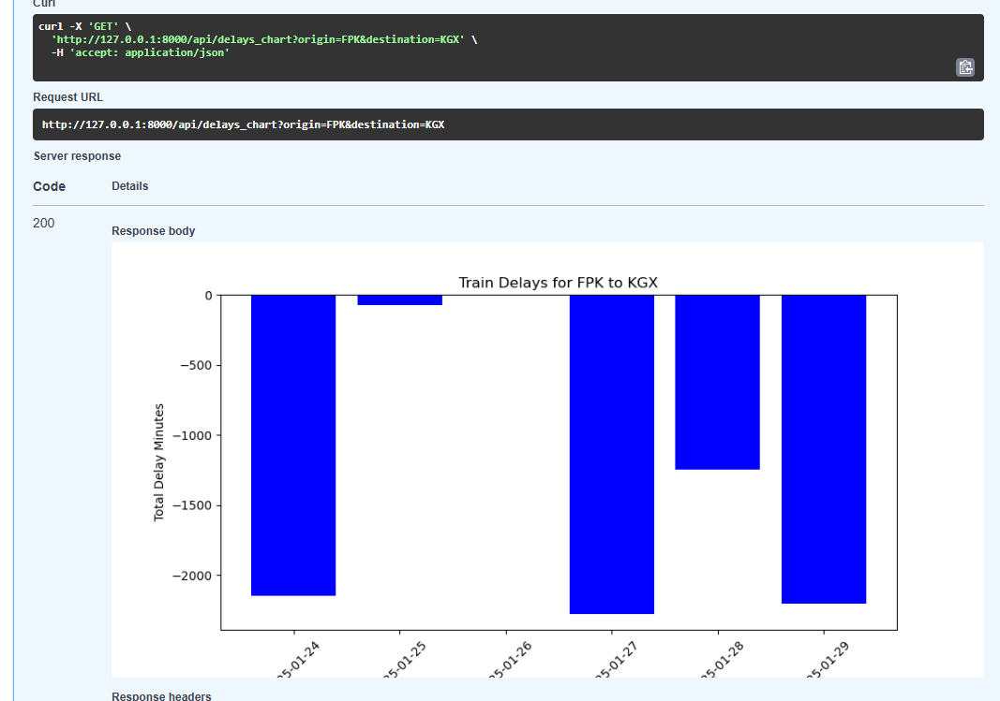

# 🚄 Geospatial Train Tracking & Delay Analysis

**Credit:** This project was only possible thanks to Realtime Trains API! 

## 📌 Project Overview
This project analyses train delays between Finsbury Park (FPK) and Kings Cross (KGX) using: `fastapi`, `uvicorn`, `requests`, `python-dotenv`, `pandas`, `sqlalchemy`, PostgreSQL, and `matliplot`. Geospatial tools like GeoPandas & Folium are in progress!

## ⚙️ Setting Up the Environment
- Create an isolated envrionment using Conda 
- Install dependencies: fastapi, uvicorn, requests, python-dotenv, pandas, matplotlib, folium, geopandas
- Store API credentials securely in an `.env` file 
- Initialise a GitHub repository for version control
- Test API connection to Realtimes Trains

## 🚀 Building the REST API
### 🏗️ FastAPI Project Structure
- Set up FastAPI to handle train delay analysis
- Define API endpoints:
    - /api/trains → Retrieve train services between stations (params: `origin`, `destination`)
    - /api/delays → Get delay statistics for trains (params: `origin`, `destination`)

**📊 Example API Response:**

## 🔎  Analysing data  
- Analyse delay over the past 6 days
- Example output from `test_df.py`:
    **Total delays in the past 6 days between Finsbury Park to Kings Cross found: 1267**

**📊 Matplotlib Delay Chart**

## 🗄️ PostgreSQL Database & Optimisation
### 🔹 Database Setup
- Store train delay data in PostgreSQL
- Use SQLAlchemy for database interactions

### 🚀 Query Optimisation
- **Partitioning**: Improve performance by storing train data in date-based partitions
- **Indexing**: Speed up lookups on frequently queried columns (`date`, `destination`)

**📉 Performance Comparison**

|Query | Before Optimization	| After Partitioning |
|--|--|--|
|`SELECT * WHERE date='2025-01-30'`|	**4.113 ms** |	**0.034 ms** |

## 🗺️ Next Steps: Geospatial Mapping
✅ Identify congestion hotspots (routes/stations)
✅ Visualize delays on a Folium map
✅ Operator performance dashboard

## 🚢 Deployment & CI/CD (Future)
✅ Docker for containerization
✅ GitHub Actions for CI/CD