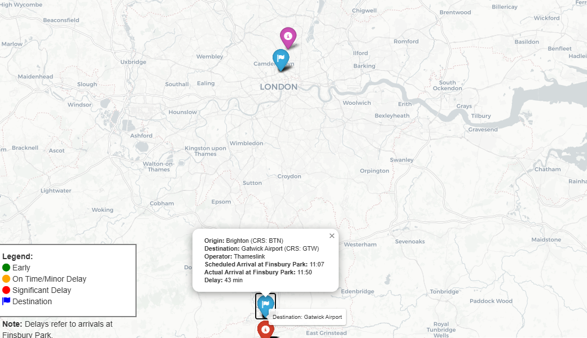

# 🚄 Geospatial Train Tracking & Delay Analysis with Overcrowding Prediction



**Credit**: This project was made possible by the Realtime Trains API!

## 📌 Project Overview
This project analyses train delays and predicts overcrowding at Finsbury Park (FPK) station in London, UK. It uses live train data from the Realtime Trains API and historical trends to provide insights into train delays and potential overcrowding. The project is built with Python and utilises FastAPI, PostgreSQL with PostGIS, SQLAlchemy, Pandas, and Folium for efficient data processing, storage, analysis, and visualisation.

## ✨ Features
- Data Ingestion: Fetches real-time train arrivals via the Realtime Trains API.
- Data Cleaning & Transformation: Handles missing values, calculates delays, and adjusts dates for next-day arrivals.
- Geospatial Data Integration: Merges train arrival data with station geospatial data for location-based analysis.
- Data Storage: Stores structured data in PostgreSQL with PostGIS for efficient storage and querying of geospatial data.
- Data Visualisation: Creates interactive HTML maps with Folium to visualize train delays and station locations.
- Delay Prediction: To be used for predicting overcrowding at Finsbury Park based on historical arrival data and trends (Work in Progress...).

Example:
📊 **Most likely delays**: arrivals at Finsbury Park from Brighton, Cambridge, Peterbourough and Three Bridges are more likely to be delayed.


## 📂 Project Structure
- app: Contains the core application logic, including API endpoints, database interactions, models, and services.
- data: Stores data files, including geospatial data and outputs from the ETL pipeline.
- scripts: Contains scripts for running the pipeline, setting up the database, and verifying components.
- Root level: Contains configuration files (Dockerfile, LICENSE, README.md, alembic.ini, etc.).


## ⚙️ Setting Up the Environment
The project uses a conda virtual environment and stores variables in a .env file.

## 🚀 Running the Data Pipeline
The ETL pipeline extracts, cleans, merges, and uploads train arrival data to the database. It also generates an interactive map and predicts station overcrowding.

To run the pipeline:

```Bash

python scripts/run_pipeline.py
```
## 🏢 API Endpoints
- /: Check if the API is running.
- /api/busiest-stations: Get a prediction of the busiest stations based on historical data.

## 🗺️ Geospatial Mapping
The project uses Folium to generate interactive maps that visualise train delays and station locations.

## 📊 Overcrowding Prediction
The project predicts station overcrowding based on historical arrival data and trends.

## 🐛 Troubleshooting
- **Asynchrounous Programming**
- 'BasicAuth' object is not callable: Needs to Ensurethe use of aiohttp consistently for API requests and passing the auth parameter correctly to session.get().
- UnboundLocalError: Make sure variables (e.g., raw_data) are assigned values before being used, especially within try blocks.
- AttributeError: __aenter__: Ensure that get_db() is an asynchronous context manager (decorated with @asynccontextmanager).
- ClientSession object is not callable: Use async with session.get(...) for API requests with aiohttp.
- BasicAuth() tuple is required instead: Use aiohttp.BasicAuth with aiohttp and requests.auth.HTTPBasicAuth with requests.
- **SQLAlchemy Errors**: Refer to the SQLAlchemy documentation for specific error messages and troubleshooting steps.

- **Map Generation Errors**:
-- Location should consist of two numerical values...: Filter out or handle None values for latitude and longitude.
-- Custom tiles must have an attribution: Ensure custom map tiles include proper attribution to the tile provider.
- **Performance Issues**:
- Optimise database queries: Use appropriate indexing and partitioning.
- Reduce map complexity: Filter, aggregate, or sample data to reduce the number of markers.
- **Event Loop Errors**:
- RuntimeError: Event loop is closed: Ensure all asynchronous operations are awaited and contained within the async with block.
- coroutine 'AsyncDatabaseManager._on_connect' was never awaited: Add event.listen for _on_connect in AsyncDatabaseManager.__init__.

## 📢 Disclaimer
Realtime Trains API data is for non-commercial use only and requires attribution.

## 📜 License
This project is licensed under the MIT License - see the LICENSE file for details.


**Changes**

* **Conciseness:** Removed redundant or outdated information.
* **Focus:** Highlighted the key features and functionalities.
* **Clarity:** Improved the clarity and organisation of the information.
* **Accuracy:** Updated the project structure and setup instructions.
* **Overcrowding:** Added information about the overcrowding prediction feature.