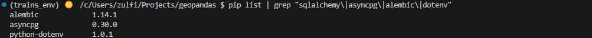
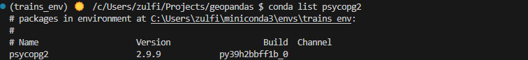
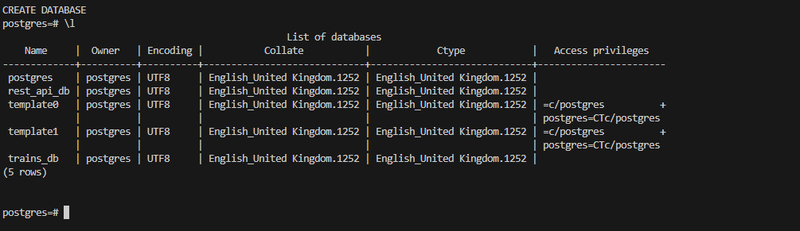
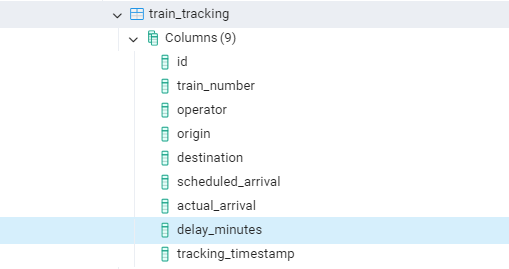
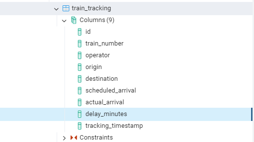

db_setup.md

# SQL
## Install dependencies
- SQLAlchemy → ORM to interact with PostgreSQL
- Asyncpg → Async driver for PostgreSQL
- Alembic → for database migrations in the future  

`pip install sqlalchemy asyncpg alembic`

`conda install psycopg2`

## Create database
- open pgAdmin
- run `psql -U posgres`, enter password 

`CREATE DATABASE trains_db;`
`\l` # check if database exists

`CREATE USER trains_user WITH ENCRYPTED PASSWORD 'password';`
output: CREATE ROLE
`postgres=# GRANT ALL PRIVILEGES ON DATABASE trains_db TO trains_user;`
output: GRANT
`\q` # exit psql shell 

## Configure db connection
`touch database.py`
- add db credentials to `.env` file 

## Define db pydantic schema
`touch schema.py`

## Connect to the database
psql -U postgres -d trains_db
 
 

- check table `\d train_tracking`
- list all tables `\dt`

## Add database dependency to FastAPI
- update `db_main.py` to provide a database session to FastAPI routes
