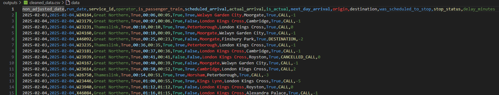
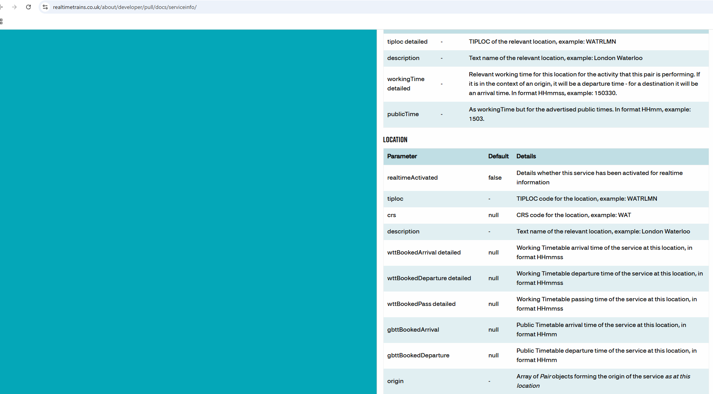
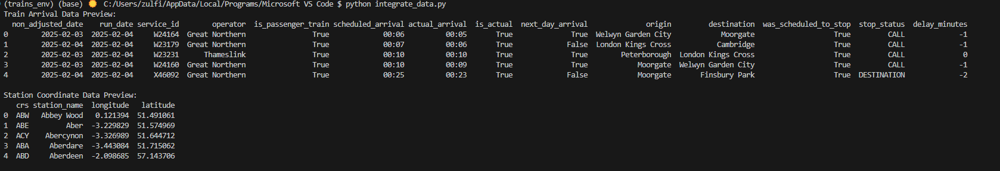
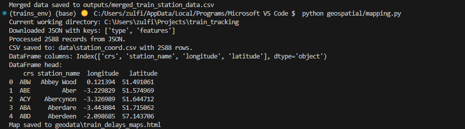
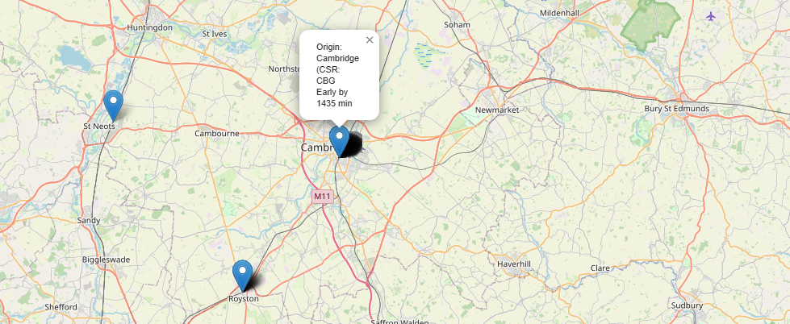
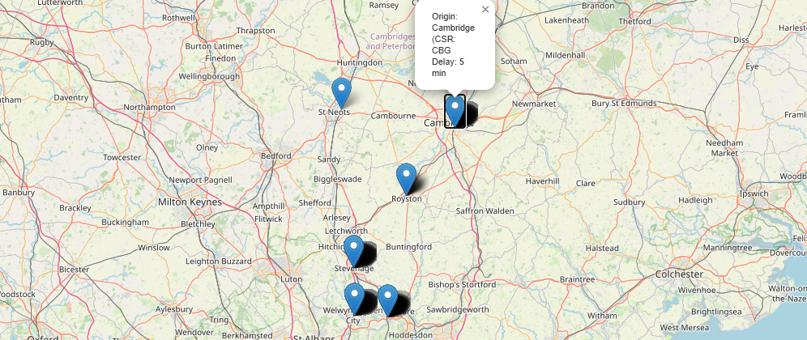

missing CRS column in cleaned_data.csv:




Lets check the realtime Train APi Documentation on how to retrieve CRS data:


 - it does not offer station codes for origin or destination stations 


 check the doogle 
 - it does offer station codes for all stations and our script already retrieves crs and station names. 


- amend 
- amend  

What This Script Does:
Loads the Two Datasets:
It reads the train arrival data and the station coordinates data into separate DataFrames.

Merges the DataFrames:
It uses a left merge on the crs column so that every record in your train arrival data is preserved, with matching station coordinates added.

Saves the Merged Data:
The merged DataFrame is saved as a CSV file for later use.

## Step 3: Run and Verify the Merge
```bash
python integrate_data.py
```

Running the command gives this output:


- columns from both the train arrival data and the station coordinates
-  file outputs/merged_train_station_data.csv has been created and contains the merged data

Here how it looks:


## Step 4: Update mapping Script to Use the Merged Data

- create new folder for geodata at the root 




## Step 5: Test mapping.py 
```bash
python geospatial/mapping.py
```

Troubl;e shoot@

Wrong delay_mionutes calculated:



Mistake in clean.py file:

Fixed now! 
