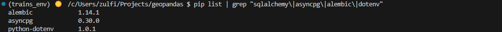
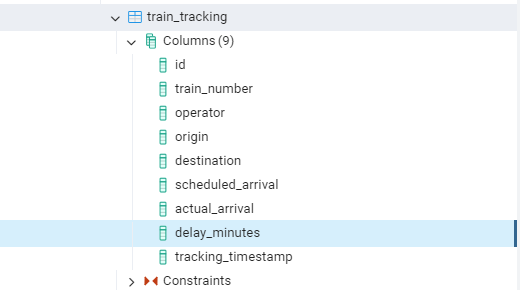
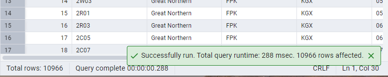

## Create Project Directory
`mkdir geopandas && cd geopands`


## GitHUb 
```bash 
git init
git remote add origin <link to GitHub repository>
```


## Isolate env

- Install miniconda following instructions on https://docs.anaconda.com/miniconda/install/


- Check hash (Recommended) with the hash on https://repo.anaconda.com/miniconda/ 



- Initialise conda in git bash shell `C:/Users/zulfi/miniconda3/Scripts/conda init bash`


- Create conda environment
- Activate the new environment `conda activate trains_env`

## Install dependencies 
fastapi, uvicorn, requests, python-dotenv, pandas, matplotlib, folium, geopandas

## Create account at Realtime Trains API
NB: "Usage of this service is subject to a very simple clause. You must, at all times, credit Realtime Trains in any work that you create from this service. Beyond that, as long as you're not using the service for commercial purposes then use it to your heart's content!"

## test FastAPoi is working
- Create a test app:

```bash
from fastapi import FastAPI

app = FastAPI()

@app.get("/")
def read_root():
    return {"Hello": "World"}
```    

`uvicorn test_fastapi:app --reload`



## Test connection to Realtime Trains:
- Write a code in `test_rtt.py` file:

```bash
import os
from dotenv import load_dotenv
import requests

#Load environment varialbes from .env file
load_dotenv()

# Retrieve environment variables 
USERNAME = os.getenv("RTT_USERNAME")
PASSWORD = os.getenv("RTT_PASSWORD")
ENDPOINT = os.getenv("RTT_ENDPOINT")

# Ensure credentuas are set
if not USERNAME or not PASSWORD or not ENDPOINT:
    raise EnvironmentError("missing environment credentials")

RTT_URL=f"https://{ENDPOINT}/json/search/LST/to/GTW"

def test_connection():
    
    try:
        response = requests.get(RTT_URL, auth=(USERNAME, PASSWORD))
        response.raise_for_status()
        data = response.json()
        print("Connection successful!")
    except requests.exceptions.RequestException as e:
        print("Connection failed")
        print("Error", e)

if __name__=="__main__":
    test_connection()
```

- Run the programm `python test_rtt.py`:

